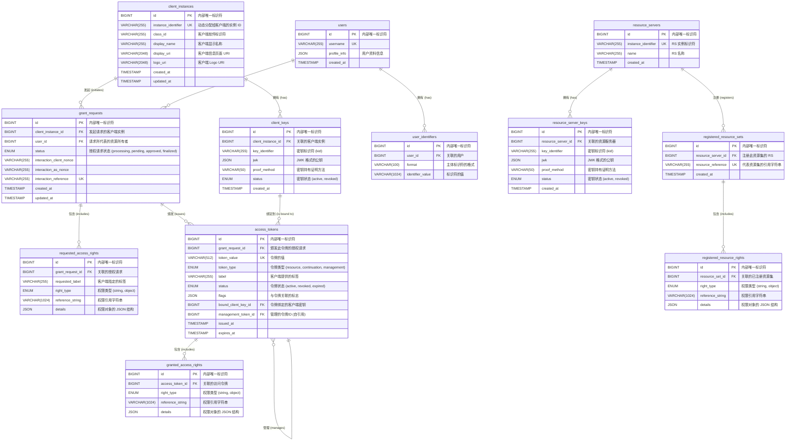
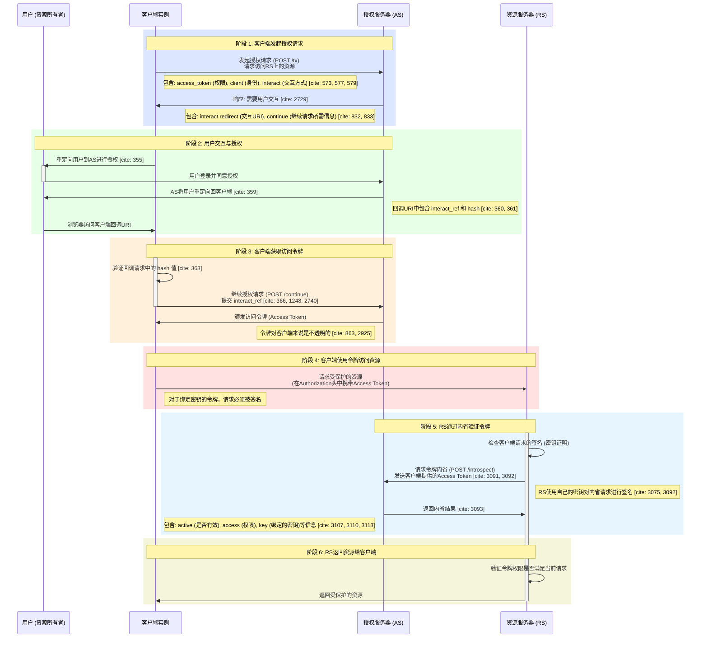

FairyUserCenter 是一款开源且**开放**的 用户 身份核验（Authentication，简称Authn）、授权（Authorization，简称Authz）服务器，你可以让你的 web服务们 依赖它，这样你就不需要自己实现用户登录注册相关的逻辑啦。 

它是 BetterInternet 计划的子项目。

它有如下特色设计：

- 轻量化、高性能
- Authz 模块 围绕 GNAP 设计 
- 使用 状态机 设计 Authn 模块 

为满足常见用例，它还附带如下组件：

- 一个 "个人中心" 应用，允许用户管理自己的账号。
- 一些 Web Component ，以方便你将 FairyUserCenter 集成到你的 web服务。

